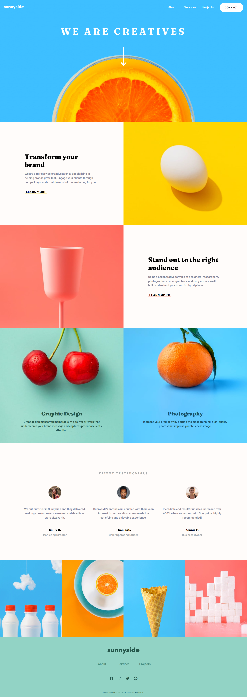

# Frontend Mentor - Sunnyside agency landing page solution

This is a solution to the [Sunnyside agency landing page challenge on Frontend Mentor](https://www.frontendmentor.io/challenges/sunnyside-agency-landing-page-7yVs3B6ef). Frontend Mentor challenges help you improve your coding skills by building realistic projects.

## Table of contents

- [Overview](#overview)
  - [The challenge](#the-challenge)
  - [Screenshot](#screenshot)
  - [Links](#links)
- [My process](#my-process)
  - [Built with](#built-with)
  - [Useful resources](#useful-resources)
- [Author](#author)

## Overview

### The challenge

Users should be able to:

- View the optimal layout for the site depending on their device's screen size
- See hover states for all interactive elements on the page

### Screenshot

### Links

- Solution URL: [Add solution URL here](https://your-solution-url.com)
- Live Site URL: [Add live site URL here](https://your-live-site-url.com)

## My process

### Built with

- CSS custom properties
- Flexbox
- CSS Grid
- Block Element Modifier (BEM)

### Useful resources

- [Write SO MUCH less CSS by using custom properties like this](https://www.youtube.com/watch?v=Wyc2hJZ_W8o&t=108s&ab_channel=KevinPowell) - At the end of the project I tried using what this video rxplains for the :focus of the page.

## Author

- Website - [Alba García](https://koalba.netlify.app/)
- Frontend Mentor - [@koalba](https://www.frontendmentor.io/profile/koalba)
- ArtStation - [Alba García](https://www.artstation.com/koal_art)
- Instagram - [Koal_Art](https://www.instagram.com/koal_art/)
